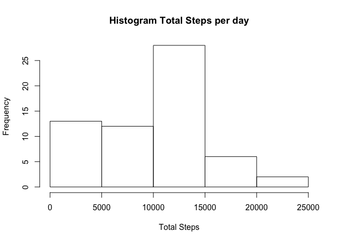
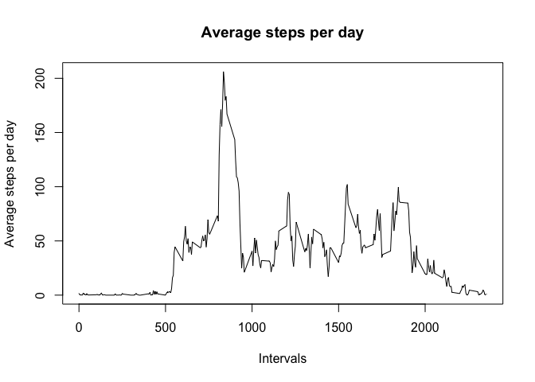
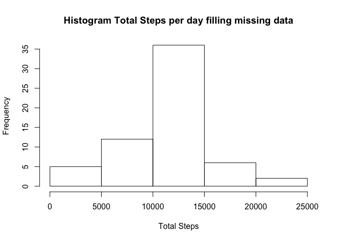
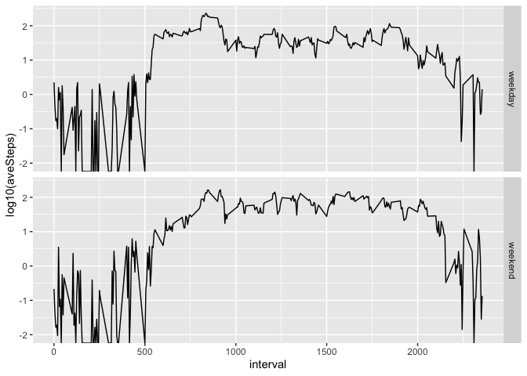

## Loading and preprocessing the data
The following code unzip and load the activity data.

```r
activitydata<-read.csv(unzip('activity.zip'))
```

## What is mean total number of steps taken per day?

The following code calculate the total steps per day, with the function
**tapply**. Then the histogram of the total steps is ploted using **hist**

```r
totalSteps<-tapply(activitydata$steps,activitydata$date, sum, na.rm=TRUE)
hist(totalSteps, main = "Histogram Total Steps per day", xlab = 'Total Steps')
```

<!-- -->

The mean of total number of steps per day is 

```
## [1] 9354.23
```
,and the median is 

```
## [1] 10395
```

## What is the average daily activity pattern?

The following code calculate the average steps per day within intervals, 
with the function **tapply**. 
Then the time series is ploted using **plot**

```r
averageSteps<-tapply(activitydata$steps,activitydata$interval, mean, na.rm=TRUE)
plot(names(averageSteps), averageSteps, type = 'l', xlab = 'Intervals', 
     ylab = 'Average steps per day', main = 'Average steps per day')
```

<!-- -->

The interval that contains the maximum number of steps is

```r
names(averageSteps[averageSteps==max(averageSteps)])
```

```
## [1] "835"
```
## Imputing missing values

The total amaount of missing values is


```r
sum(is.na(activitydata$steps))
```

```
## [1] 2304
```

To fill the missing values, the following use the mean of each interval per day
calculated without the missing values


```r
averageSteps<-tapply(activitydata$steps,activitydata$interval, mean, na.rm=TRUE)
numRows<-dim(activitydata)[1]
activitydata1<-activitydata
for (i in 1:numRows) {
  ifelse(is.na(activitydata$steps[i]), activitydata1$steps[i]<-
           averageSteps[names(averageSteps)==activitydata$interval[i]],
         activitydata1$steps[i]<-activitydata$steps[i])
  activitydata1$date[i]<-activitydata$date[i]
  activitydata1$interval[i]<-activitydata$interval[i]
}
totalSteps<-tapply(activitydata1$steps,activitydata1$date, sum)
hist(totalSteps, main = "Histogram Total Steps per day filling missing data",
     xlab = 'Total Steps')
```

<!-- -->

```r
mean(totalSteps)
```

```
## [1] 10766.19
```

```r
median(totalSteps)
```

```
## [1] 10766.19
```
The results of the mean and the median increase by fu¡illing the missing data


## Are there differences in activity patterns between weekdays and weekends?

please install **ggplot2**, **data.table**, **lubridate**, and **dplyr**
packages


```r
library(ggplot2)
```

```
## Warning: package 'ggplot2' was built under R version 3.6.2
```

```r
library(data.table)
```

```
## Warning: package 'data.table' was built under R version 3.6.2
```

```r
library(lubridate)
```

```
## Warning: package 'lubridate' was built under R version 3.6.2
```

```
## 
## Attaching package: 'lubridate'
```

```
## The following objects are masked from 'package:data.table':
## 
##     hour, isoweek, mday, minute, month, quarter, second, wday, week,
##     yday, year
```

```
## The following objects are masked from 'package:base':
## 
##     date, intersect, setdiff, union
```

```r
library(dplyr)
```

```
## Warning: package 'dplyr' was built under R version 3.6.2
```

```
## 
## Attaching package: 'dplyr'
```

```
## The following objects are masked from 'package:data.table':
## 
##     between, first, last
```

```
## The following objects are masked from 'package:stats':
## 
##     filter, lag
```

```
## The following objects are masked from 'package:base':
## 
##     intersect, setdiff, setequal, union
```

```r
activitydata1<-as.data.table(activitydata1)
activitydata1[,weekDay:=ifelse(wday(as.Date(date))==7 | wday(as.Date(date))==1, 'weekend', 'weekday')]
partial<-group_by(activitydata1, interval, weekDay)
weekSummary<-summarise(partial,aveSteps=mean(steps))
```

```
## `summarise()` has grouped output by 'interval'. You can override using the `.groups` argument.
```

```r
qplot(interval,log10(aveSteps), data=weekSummary, facets = as.factor(weekDay)~., geom = 'line')
```

<!-- -->
